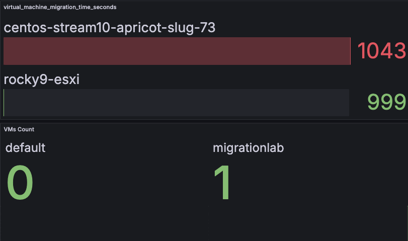

# vmmig_bench

**Contact**: luckysideburn@gmail[dot]com  

## Overview

A Prometheus exporter designed to extract metrics for OpenShift Virtualization (KubeVirt).



## Metrics Example

Below is an example of the metrics exposed by the `vmmig_bench` exporter:
```bash
# HELP virtual_machine_count_total Total number of virtual machines in the namespace
# TYPE virtual_machine_count_total gauge
virtual_machine_count_total{namespace="default"} 0
virtual_machine_count_total{namespace="migrationlab"} 1
# HELP virtual_machine_migration_time_seconds Time taken for virtual machine migrations in the namespace
# TYPE virtual_machine_migration_time_seconds gauge
virtual_machine_migration_time_seconds{namespace="",vm_name="centos-stream10-apricot-slug-73"} 1043
virtual_machine_migration_time_seconds{namespace="",vm_name="rocky9-esxi"} 999
# HELP virtual_machine_status Status of a virtual machine in the namespace
# TYPE virtual_machine_status gauge
virtual_machine_status{namespace="migrationlab",status="Running",vm_name="rocky9-esxi"} 1
````

## Getting Started

### Prerequisites

- Go 1.18+ installed
- Properly configured virtual machine environment

### Starting the Exporter

To start the exporter, execute the following command:

```bash
go run main.go start --namespaces $OCP_NAMESPACES --token $OCP_TOKEN --server-url $OCP_SERVER_URL 
```

Set the following environment variables before running the command:

- `OCP_TOKEN`: Your OpenShift API token (e.g., `xxx`)
- `OCP_SERVER_URL`: The OpenShift server URL (e.g., `https://api.migrationlab.devopstribe.it:6443`)
- `OCP_NAMESPACES`: Comma-separated list of namespaces (e.g., `migrationlab,default`)

## To Do

1. Define a `ClusterRole` and a `ClusterRoleBinding` to allow a service account to call the OpenShift APIs used by this exporter.
2. Add additional useful metrics.

## Contributing

Feel free to fork the repository and submit pull requests. For any questions or suggestions, contact me at luckysideburn@gmail[dot]com.

## License

This project is licensed under the Apache 2.0 License.